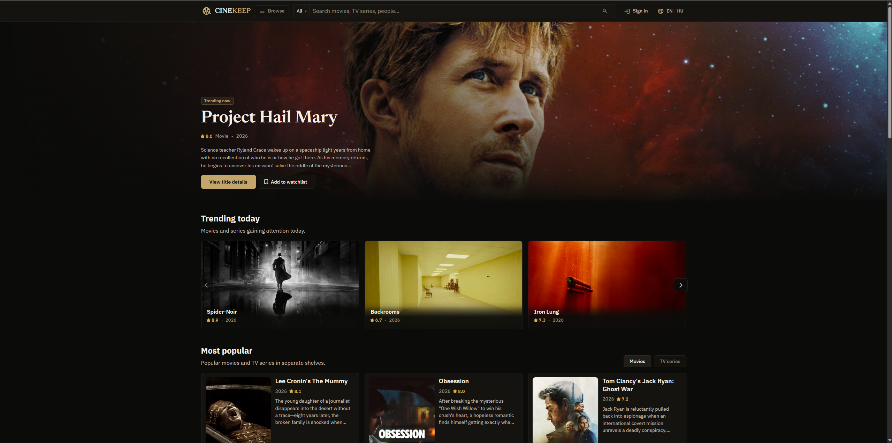

# CineKeep

CineKeep is an IMDb-inspired movie and TV discovery app powered by
[The Movie Database (TMDB)](https://www.themoviedb.org/). It is built as a
modern Angular frontend for browsing titles, people, collections, reviews,
videos, photos, episodes, and TMDB account lists from one polished interface.



[SSR deployment](https://cinekeep.vercel.app/) · [Static GitHub Pages deployment](https://dtoro97.github.io/cinekeep/)

## Highlights

- Search movies, TV series, actors, and creators.
- Browse trending, popular, top-rated, now-playing, upcoming, and airing titles.
- Filter discovery results by media type, genre, rating, vote count, runtime,
  release window, language, and watch provider.
- Open rich movie and TV detail pages with overview, cast and crew, seasons,
  episodes, videos, image galleries, reviews, keywords, and external links.
- Explore person profiles with biographies, known-for titles, full credits, and
  photo galleries.
- Browse movie collections and streaming/provider-focused shelves.
- Sign in with TMDB to manage watchlists, favorites, ratings, and custom lists
  where account access is available.

## Tech Stack

- [Angular](https://angular.dev/) 21
- TypeScript
- SCSS
- Angular Material/CDK
- RxJS
- `@ngrx/component-store`
- Generated Angular clients for TMDB v3 and focused TMDB v4 list/account APIs
- Angular SSR deployment on Vercel with static GitHub Pages deployment support

## Notable Implementation Details

- Standalone Angular components with route-level lazy loading for feature areas.
- ComponentStore-powered feature state for discovery, search, detail pages, and
  account flows.
- Generated API clients are paired with app-facing services, mappers, and UI
  models.
- TMDB account integration supports watchlists, favorites, ratings, and custom
  lists where the runtime has account API access.
- Separate environment targets support local development, SSR Vercel builds,
  and static GitHub Pages builds.

## Getting Started

### Prerequisites

- Node.js `^20.19.0`, `^22.12.0`, or `>=24.0.0`
- npm `10.9.2` or compatible
- A TMDB API Read Access Token

You can create a TMDB API Read Access Token from your TMDB account settings.
Paste the token value without a `Bearer` prefix. TMDB documents that the API is
free for non-commercial use when TMDB is attributed as the source of the data
and images.

### Install

```bash
npm install
```

### Configure The Local Environment

Create `src/environments/environment.development.ts` for local development.
This file is ignored by Git so your token stays out of the repository.

```ts
export const environment = {
    production: false,
    apiUrl: 'https://api.themoviedb.org/3',
    apiV4Url: 'https://api.themoviedb.org/4',
    apiKey: 'YOUR_TMDB_READ_ACCESS_TOKEN',
};
```

### Run The App Locally

```bash
npm start
```

Open [http://localhost:4200](http://localhost:4200).

## Local Production Build

```bash
npm run build
```

Serve the built SSR output locally:

```bash
npm run serve:ssr:cinekeep
```

## Useful Scripts

| Command                         | Description                                                                      |
| ------------------------------- | -------------------------------------------------------------------------------- |
| `npm start`                     | Starts the Angular dev server.                                                   |
| `npm run build`                 | Creates a local production build.                                                |
| `npm run serve:ssr:cinekeep`    | Serves the local SSR build output.                                               |
| `npm run build:github-pages`    | Builds the static GitHub Pages bundle.                                           |
| `npm run deploy:github-pages`   | Builds and deploys the GitHub Pages bundle.                                      |
| `npm run watch`                 | Builds in watch mode with the development configuration.                         |
| `npm run generate-api`          | Regenerates the TMDB v3 Angular API client from `openapi.json`.                  |
| `npm run generate-api:v4`       | Regenerates the focused TMDB v4 Angular API client from `openapi-v4-lists.json`. |

## Deployment

The primary production deployment is the SSR Vercel app:
[https://cinekeep.vercel.app/](https://cinekeep.vercel.app/).

The production build keeps SSR output under `dist/cinekeep` and can be served
locally after `npm run build`:

```bash
npm run serve:ssr:cinekeep
```

The GitHub Pages deployment remains available as a static build:
[https://dtoro97.github.io/cinekeep/](https://dtoro97.github.io/cinekeep/).
Its workflow replaces the production `${API_KEY}` placeholder from the
`API_KEY` secret before building:

```bash
npm run build:github-pages
```

## Project Structure

```text
src/app/features     Lazy feature areas for home, discover, media, person, user, watch, search, and collections
src/app/shared       Shared UI primitives, services, mappers, models, pipes, and utilities
src/app/api          Generated TMDB v3 Angular client
src/app/api-v4       Generated focused TMDB v4 Angular client
src/styles           Global SCSS entry points, tokens, typography, theme, base, and utilities
tools                Local build helpers
public               Static public assets
```

## Data And Attribution

This project uses TMDB and the TMDB APIs for movie, TV, person, image, video,
review, provider, account, and list data. It is not endorsed, certified, or
otherwise approved by TMDB.

Movie and TV imagery belongs to its respective owners and is provided through
TMDB.

## License

[MIT](LICENSE)
